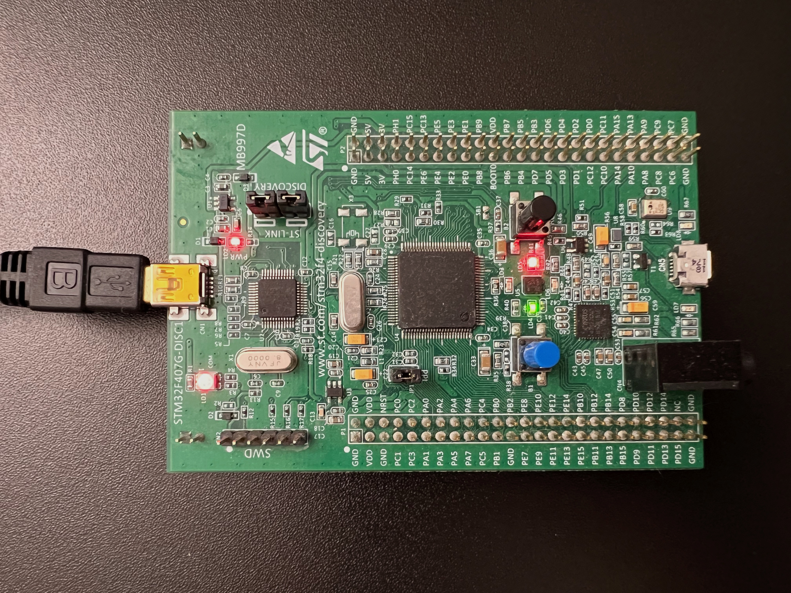

Typically, it is assumed that the Supervisor Call (SVC) exception on Cortex-M series is synchronous, triggering immediately following the execution of an SVC instruction rather than at arbitrary points during program execution. This presumption underpins the design of the system call interface: The saved register values at the entry point of the SVC handler are read and used as arguments for the system call. Alternatively, some might leverage the stored program counter (PC) register value to locate the SVC instruction binary and extract the enclosed immediate value from within the instruction. However, the above design breaks if SVC is triggered asynchronously, because the preserved register values are no longer system call arguments but instead arbitrary values from the current execution context.

An asynchronous trigger of the SVC can occur if exception priority is changed dynamically during the execution of exception handlers. This is possible due to a feature of Cortex-M to optimize the handling latency of *late-arriving high priority* exception.

Quoting from ARM Documentation [KA001190](https://developer.arm.com/documentation/ka001190/latest/):

> What is the late-arriving interrupt behaviour?
>
> A late-arriving interrupt is an interrupt which is recognized after the processor has started its exception entry procedure. If the late-arriving interrupt has higher pre-empting priority than the exception which the processor has already started to handle, then the existing stack push will continue but the vector fetch will be re-started using the vector for the late-arriving interrupt.

Therefore, an unexpected scenario may arise when the CPU initiates the exception entry procedure pushing register values onto the stack after executing an SVC instruction: If a higher priority exception is raised during this process, the SVC operation will be *pended* and the higher priority exception handler will be invoked. However, within the handler of the high-priority exception, if we alter the priority of SVC to surpass it, or decrease its priority below that of the SVC, the previously pended SVC will be activated as a nested exception, preempting the handler currently in execution.

The following is a minimal code sample illustrating that the above scenario can indeed occur. We have the SysTick exception acting as the additional exception in the system, apart from SVC. The following functions alter the priority levels of SVC and SysTick, making the priority of SVC alternately below and above than SysTick. Note that lower numeric value means higher priority on Cortex-M.

```c
// Set SVC priority higher than SysTick.
void set_svc_high_priority(void) {
    SCB->SHP[SVCall_IRQn + 16 - 4] = 32;
}

// Set SVC priority lower than SysTick.
void set_svc_low_priority(void) {
    SCB->SHP[SVCall_IRQn + 16 - 4] = 96;
}

// Set SysTick priority in the middle.
void set_systick_mid_priority(void) {
    SCB->SHP[SysTick_IRQn + 16 - 4] = 64;
}
```

Inside SysTick handler, we alter the priority of SVC to let it temporarily be above SysTick.

```c
// The SysTick exception handler. It raises the priority of SVC to above
// itself, increments the counter, and lowers the priority of SVC back to
// below itself.
void SysTick_Handler(void) {
    set_svc_high_priority();

    // *** SVC CAN UNEXPECTEDLY BE INVOKED RIGHT HERE! ***

    ++TICK_COUNT;
    set_svc_low_priority();
}
```

To detect the unexpected invocation of SVC, as previously described, we execute the worker function with the process stack pointer (PSP) and the handler functions with the main stack pointer (MSP). The context that the SVC handler sees, whether it was previously running in the worker function or SysTick handler, can be discerned by examining a specific bit in the exception return pattern found in the `lr` register upon entering the SVC handler. This particular bit signifies whether we were operating with the PSP or MSP prior to invoking the SVC handler. If the SVC handler is determined to be nested, we turn on the red LED and then spin, as illustrated below.

```c
// The SVC handler. It turns on the red LED and spin if being invoked
// when the code was running using MSP. In this code example, the `worker()`
// function will run with PSP, and exception handlers will run with MSP.
// If SVC handler sees itself being invoked when the code was already
// running with MSP, it means the SVC is nested above another exception
// handler, in which case we hang it. Otherwise, it simply returns and
// does nothing.
void __attribute__((naked)) SVC_Handler(void) {
    asm volatile (
        "mov r0, lr               \n"
        "b die_if_called_with_msp \n"
        :::
    );
}

// Determine if it is nested exception by examining the exception return
// pattern stored in `lr` register upon exception. Turn on red LED and spin
// if nested.
void die_if_called_with_msp(uint32_t lr) {
    if ((lr & 0x4) == 0) {
        toggle_red_led();
        while (1);
    }
}
```

Finally, the worker function initializes the system and toggles the green LED every second. While it awaits the next blink interval, it continuously triggers SVC. Under normal circumstances, SVC is initiated upon the execution of the SVC instruction, without nesting, and the green LED continues to blink. However, due to the dynamic changes in priority, there are cases when the SVC handler finds itself nested above the SysTick handler, thus the red LED will be turned on.

```c
int worker(void) {
    // Let SysTick fire every 0.1ms.
    init_systick_in_hz(10000);

    // Let SVC have a lower priority than SysTick.
    set_svc_low_priority();
    set_systick_mid_priority();

    enable_leds();

    while(1) {
        // Wait for 1 second. Meanwhile, invoke SVC. Since we only invoke
        // SVC from here, running with PSP, the SVC handler should not spin,
        // but it will.
        uint32_t next_tick = TICK_COUNT + 10000;
        while (TICK_COUNT < next_tick)
            asm volatile ("svc #0");
        
        // If we are still running, toggle the green LED.
        toggle_green_led();
    }

    return 0;
}
```

See the red LED turned on.



Full code here: https://github.com/ZhiyaoMa98/async_svc
