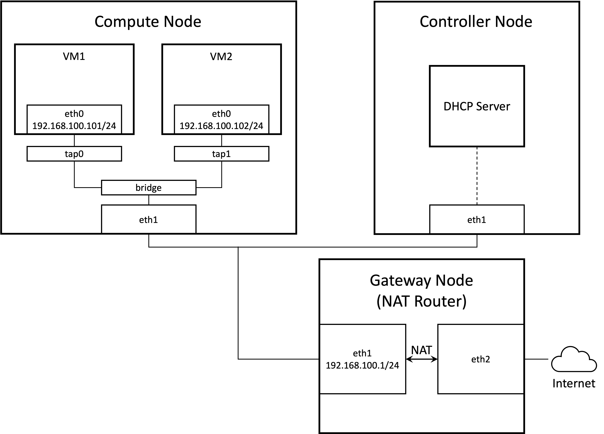
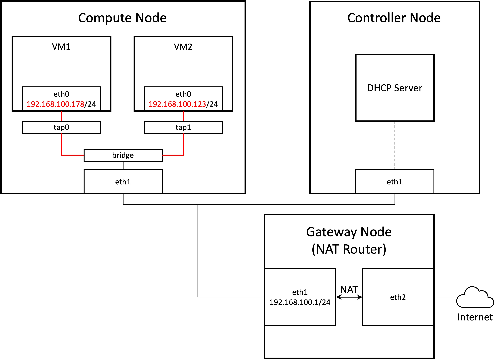
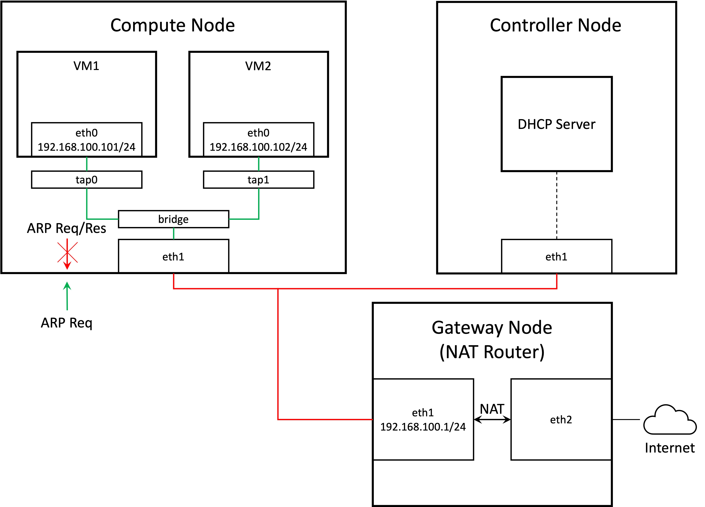

TL; DR: Enable MAC address spoofing in Hyper-V manager network adapter settings if nested VMs are bridged onto that NIC.

## Background

I am recently working on deploying [OpenStack](https://www.openstack.org/software/) in a virtualized environment hosted by Hyper-V. OpenStack is a platform that allows one to spawn VMs inside a set of compute nodes. The creation and deletion of VMs are achieved by interacting with the controller node. The minimum setup of OpenStack cluster is comprised of one controller node and one or more compute nodes. Other specialized nodes are optional.

Since my controller and compute node are all Hyper-V VMs, the VMs running inside the compute node are thus nested VMs.

The controller and compute nodes communicates through the *management network*, through which the controller node sends the VM image to a chosen compute node and configures several running parameters. The management network provides internet access to the controller and compute nodes.

To provide internet access to the nested VMs, we need additionally a *provider network*. Thus, each node must have two NICs. One is connected to the management network while the other to the provider network. Nested VMs bridge onto the latter NIC to gain link-layer connectivity to the provider network. Note that neither the controller node nor the compute nodes routes traffic through the provider network, only nested VMs do.

According to OpenStack's [installation guide](https://docs.openstack.org/install-guide/), each node is configured with a static IP address on the management network. The nested VMs are provided with dynamic IP addresses by the DHCP server running inside the controller node. The following figure shows the *provider network topology*.



The gateway node provides internet access to the provider network through network address translation (NAT, [tutorial](https://www.linuxsysadmins.com/setup-a-linux-server-as-a-nat-router/)). The address `192.168.100.1` assigned to `eth1` on the gateway node is configured statically. In my setup, the DHCP server running inside the controller node assigns IP address within the range `192.168.100.101 - 192.168.100.200` to the nested VMs. Two instances are shown in the figure.

It is worth noting that all `eth1` in the figure correspond to the virtual NICs created by Hyper-V that hosts the three nodes. `eth0` corresponds to the NICs created by the hypervisor running nested VMs.

## Diagnose Disconnectivity Among Nested VMs

During my deployment of OpenStack, at a time I was able to spawn nested VMs, but they could not receive and configure their IP addresses through DHCP. I manually assigned IP addresses to their network interfaces and also configured their route tables, but the two VMs yet could not ping each other.

The disconnectivity is shown in red lines in the figure below.



It turned out that when OpenStack spawns the nested VMs, it also configures several firewalls on the compute node. One that was impeding the network connection between nested VMs is `ebtables`. This is a link-layer firewall that works similarly to `iptables`. OpenStack configures `ebtables` on the compute node so that a VM cannot send out ARP packets containing an IP address other than the assigned one.

Assuming that OpenStack decides to assign `192.168.100.101` to VM1. If I manually configure its `eth0` to have `192.168.100.178`, which differs from OpenStack's assignment, no ARP packet can make its way out of `tap0` and thus VM1 essentially loses link layer connectivity.

The fix is easy though. If we are to manually configure the IP addresses for nested VMs, just read the logs of OpenStack (specifically, the log of the neutron service) and set exactly the same address as written in the log to the nested VMs.

## Diagnose Disconnectivity Between Nested VMs and Gateway Node

After I established the connectivity between nested VMs, two problems persisted.

1. The DHCP was not working. I must manually configure the IP addresses and route tables for nested VMs.
2. Even if I configured them by hand correctly, no nested VM could ping the gateway node.

The red and green lines show disconnectivity and connectivity respectively in the figure below.



To better understand the situation, I captured network packets on `eth1` on both the compute and gateway node while the VM and gateway node were pinging each other.

```raw
> sudo tcpdump -i eth2 -vv "icmp or arp"
```

The result reveals an important clue for me to resolve the problem. When *the VM was pinging the gateway*:

```raw
# Captured on eth1 on the *compute node*
17:55:17.971474 ARP, Ethernet (len 6), IPv4 (len 4), Request who-has 192.168.100.1 tell 192.168.100.101, length 28
17:55:18.960859 ARP, Ethernet (len 6), IPv4 (len 4), Request who-has 192.168.100.1 tell 192.168.100.101, length 28
17:55:19.960935 ARP, Ethernet (len 6), IPv4 (len 4), Request who-has 192.168.100.1 tell 192.168.100.101, length 28

# Nothing captured on eth1 on the *gateway node*
```

Interestingly, when *the gateway was pinging the VM*:

```raw
# Captured on eth1 on the *compute node*
18:02:24.116606 ARP, Ethernet (len 6), IPv4 (len 4), Request who-has 192.168.100.101 tell 192.168.100.1, length 28
18:02:24.118396 ARP, Ethernet (len 6), IPv4 (len 4), Reply 192.168.100.101 is-at fa:16:3e:12:3d:ae (oui Unknown), length 28
18:02:25.119711 ARP, Ethernet (len 6), IPv4 (len 4), Request who-has 192.168.100.101 tell 192.168.100.1, length 28
18:02:25.120200 ARP, Ethernet (len 6), IPv4 (len 4), Reply 192.168.100.101 is-at fa:16:3e:12:3d:ae (oui Unknown), length 28
18:02:26.143859 ARP, Ethernet (len 6), IPv4 (len 4), Request who-has 192.168.100.101 tell 192.168.100.1, length 28
18:02:26.144907 ARP, Ethernet (len 6), IPv4 (len 4), Reply 192.168.100.101 is-at fa:16:3e:12:3d:ae (oui Unknown), length 28

# Captured on eth1 on the *gateway node*
18:02:24.113859 ARP, Ethernet (len 6), IPv4 (len 4), Request who-has 192.168.100.101 tell 192.168.100.1, length 28
18:02:25.117075 ARP, Ethernet (len 6), IPv4 (len 4), Request who-has 192.168.100.101 tell 192.168.100.1, length 28
18:02:26.141014 ARP, Ethernet (len 6), IPv4 (len 4), Request who-has 192.168.100.101 tell 192.168.100.1, length 28
```

We can conclude two points from the trace:

1. The gateway could not hear the ARP request nor response from the VM.
2. The VM *could* hear the ARP request from the gateway.

The figure above also includes our insight here.

It is quite natural to speculate that some other firewall rules lead to the asymmetricity in the ARP traffic. Unfortunately, even after I disabled all the security related system services I am aware of, the problem persisted. These include SELinux and `firewalld`.

If nothing seemed to be wrong with the software settings, we should start to question the hardware, i.e., the (virtualized) NIC.

The first question I asked was whether `eth1` on the compute node was working normally. And it actually was. If I assign an IP address, say `192.168.100.2/24` to it, then the compute and gateway node could ping each other.

Though the experiment above did not yield a direct solution, it provided a new clue for us:

1. The `eth1` NIC on the compute node *can* send out packets for itself.
2. The `eth1` NIC on the compute node *cannot* send out packets for the nested VMs.

What is fundamentally different between the packet from the nested VMs and that from the compute node? The MAC source address. We can conclude that when the packet's MAC source address differs from the MAC address of `eth1`, the packet will be dropped.

Is there a setting in Hyper-V that regulates such behavior of `eth1`? The answer is positive. In the settings of the NIC on the compute node, inside "advanced features" we can see a checkbox named "enable MAC address spoofing" that is off by default. Quoting the description of it below.

> MAC address spoofing allows virtual machines to change the source MAC address in outgoing packets to one that is not assigned to them.

Bingo. That is exactly what we want. Turn it on, and the problem solved!
