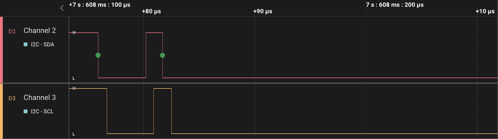

While using the `stm32f4xx-hal` crate in Rust, I encountered an issue with the I²C peripheral becoming unresponsive after implementing fine-grained IRQ disabling in my code. An analysis using a logic analyzer unveiled an unexpected occurrence: two consecutive start conditions just before the I²C stuck, as shown in the following figure.



It is weird since the HAL library does not contain any code paths that would intentionally generate consecutive start conditions. Upon conducting a more thorough investigation, I discovered that the [buggy lines of code](https://github.com/stm32-rs/stm32f4xx-hal/blob/6ab795acc75b52499c8014b4c4c2113443580325/src/I2C/dma.rs#L424-L427) responsible for this anomaly were as follows.

```rust
I2C.cr1.modify(|_, w| w.start().set_bit());
if read {
    I2C.cr1.modify(|_, w| w.ack().set_bit());
}
```

The `modify` method executes a read-modify-write operation on the `cr1` control register, as can be verified with the following disassembly code. Notably, the `read` variable is assigned a constant `true` within the example, which results in the elimination of the if comparison due to compiler optimization.

```
 8004a5e:	f645 4400 	movw	r4, #23552	@ 0x5c00
 8004a62:	4605      	mov	r5, r0
 8004a64:	f2c4 0400 	movt	r4, #16384	@ 0x4000    // r4 holds cr1 address
 8004a68:	4688      	mov	r8, r1
 8004a6a:	6820      	ldr	r0, [r4, #0]              // read cr1 [first read]
 8004a6c:	466e      	mov	r6, sp
 8004a6e:	f440 7080 	orr.w	r0, r0, #256	@ 0x100   // modify start bit
 8004a72:	6020      	str	r0, [r4, #0]              // write cr1 [first write]
 8004a74:	6820      	ldr	r0, [r4, #0]              // read cr1 [second read]
        /*  Code breaks if IRQ here  */
 8004a76:	f440 6080 	orr.w	r0, r0, #1024	@ 0x400   // modify ack bit
        /*  Code breaks if IRQ here  */
 8004a7a:	6020      	str	r0, [r4, #0]              // write cr1 [second write]
```

The issue arises when an IRQ occurs between the second read and write operations. Due to the CPU's faster execution speed compared to the peripheral, it is highly likely that the second read operation will still observe the `cr1` register with the `start` bit set. However, if an IRQ is serviced, the peripheral may have sufficient time to complete generating the start condition, resulting in the hardware clearing the `start` bit in the peripheral's `cr1` register. Nonetheless, the copy of the `cr1` register stored in `r0` during the second read operation will still retain the `start` bit set. Consequently, when the second write operation is executed on `cr1`, the `start` bit is once again set. As a result, the peripheral attempts to generate a second start condition, leading to a situation where the I²C peripheral becomes unresponsive in my specific case.

While it may appear that enclosing the read-modify-update operation within a critical section could potentially resolve the issue, it does not provide a foolproof solution. Even with the critical section in place, there is no guarantee that no bit will be altered by hardware between the read and write operations. Although the likelihood since the CPU runs a lot faster than peripherals, it remains a possibility. Therefore, in general, it is advisable to avoid using read-modify-write operations on self-changing registers, unless it can be assured that even in cases like the one described above, it will not lead to any troublesome consequences.

In the specific issue I encountered, the solution is rather straightforward: simply swapping the order of the two method calls resolves the problem.

```rust
if read {
    I2C.cr1.modify(|_, w| w.ack().set_bit());
}
I2C.cr1.modify(|_, w| w.start().set_bit());
```

Once the `ack` bit is set, it will not be automatically cleared, thus we are safe even if being interrupted in between.

Or even a better way, as suggested by the reviewer during pull request, is to combine the potential two read-modify-write into a single one.

```rust
if read {
    I2C.cr1.modify(|_, w| w.ack().set_bit().start().set_bit());
} else {
    I2C.cr1.modify(|_, w| w.start().set_bit());
}
```

`stm32f4xx-hal` bug fix pull request [here](https://github.com/stm32-rs/stm32f4xx-hal/pull/662).
