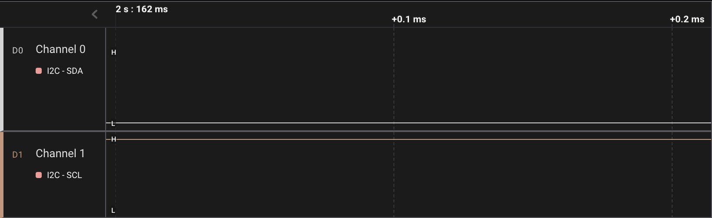
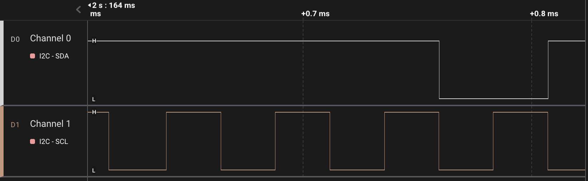

I encountered an issue with my STM32F405 MCU where, after a software reset such as by executing a `load` command in GDB connected to the MCU through OpenOCD, the code flashed onto the board would fail to run properly because the I²C was found to be busy during the initialization stage, preventing any progress from being made. Interestingly, however, the problem could be resolved by simply turning off and then back on the power, after which the code would run without any issues."

A closer examination on the wire using a logic analyzer revealed that when the I²C was found to be busy after a software reset, the SDA line was being pulled low while the SCL line remained high, as shown below.



The reason for this issue was that, upon performing a software reset, the peripheral connected to the I²C bus was in the middle of a multi-byte transmission. In my setup, the MCU was operating in I²C master mode reading from the peripheral which was in slave mode. Upon the software reset, the peripheral was controlling the SDA line and waiting for the clock signal sent by the master on the SCL line to transmit the next byte. 

Unfortunately, the MCU had forgotten the state in the I²C registers after the software reset, while the slave peripheral was still holding the SDA line and waiting for the clock signal. As a result, the busy bit in the I²C `SR2` register on the MCU side was set high, because it saw that the SDA line was being pulled low. A well-designed hardware abstraction layer (HAL) library will typically wait until the busy bit is cleared before performing any subsequent action on the I²C bus, thus causing it to hang indefinitely.

In order to resolve this deadlock scenario, we must let the slave peripheral release the SDA line. The basic idea is to manually generate some clock pulses on the SCL line, allowing the peripheral to send the pending byte, and then signal the end of the transmission by returning a NACK. To recap, during a multi-byte master mode read, an ACK should be returned if you want to read one more byte, whereas a NACK should be returned if you do not want to read any more bytes. The ACK is signaled by the master pulling the SDA line low at the 9th clock, after the first 8 clocks for bit transmission, while the NACK is signaled by pulling the SDA line high.

On STM32F405, `I2C3` uses `PA8` for the SCL line and `PC9` for the SDA line. Below is the example code written in C using CMSIS.

```c
void stm32f405_i2c3_release(void) {
    // PA8 is I2C3 SCL.
    // PC9 is I2C3 SDA.

    // Set PA8 and PC9 to output mode.
    GPIOA->MODER  &= ~(3 << 8*2);
    GPIOA->MODER  |= (1 << 8*2);
    GPIOC->MODER  &= ~(3 << 9*2);
    GPIOC->MODER  |= (1 << 9*2);

    // Set them to open-drain output.
    GPIOA->OTYPER |= (1 << 8);
    GPIOC->OTYPER |= (1 << 9);

    // Set the SDA line to high, so that after the slave releases
    // the SDA and listen for ACK/NACK, it will get a NACK.
    GPIOC->ODR |= (1 << 9);

    // Generate 10 clock pulse on the SCL line.
    for (int i = 0; i < 10; ++i) {
        // Set SCL high.
        GPIOA->ODR |= (1 << 8);

        // Wait for a while.
        for (int j = 0; j < 1000; ++j)
            __NOP();
        
        // Set SCL low.
        GPIOA->ODR &= ~(1 << 8);

        // Wait for a while.
        for (int j = 0; j < 1000; ++j)
            __NOP();
    }

    // Set SCL high. When I2C is idle the line should be pulled high.
    GPIOA->ODR |= (1 << 8);
}
```

Here is the Rust version as well.

```rust
fn stm32f405_i2c3_release() {
    let dp = unsafe { pac::Peripherals::steal() };

    dp.GPIOA.moder.modify(|_, w| w.moder8().output());
    dp.GPIOA.otyper.modify(|_, w| w.ot8().push_pull());

    dp.GPIOC.moder.modify(|_, w| w.moder9().output());
    dp.GPIOC.otyper.modify(|_, w| w.ot9().push_pull());

    dp.GPIOC.odr.modify(|_, w| w.odr9().set_bit());
    for _ in 0..10 {
        dp.GPIOA.odr.modify(|_, w| w.odr8().set_bit());
        for _ in 0..1000 {
            cortex_m::asm::nop();
        }
        dp.GPIOA.odr.modify(|_, w| w.odr8().clear_bit());
        for _ in 0..1000 {
            cortex_m::asm::nop();
        }
    }
    dp.GPIOA.odr.modify(|_, w| w.odr8().set_bit());
}
```

The code snippets above should be placed after the clock for the GPIO pins are enabled.

We can observe the manually generated clock pulses on a logic analyzer, which cause the peripheral to release the SDA line, allowing us to proceed with the normal initialization code


