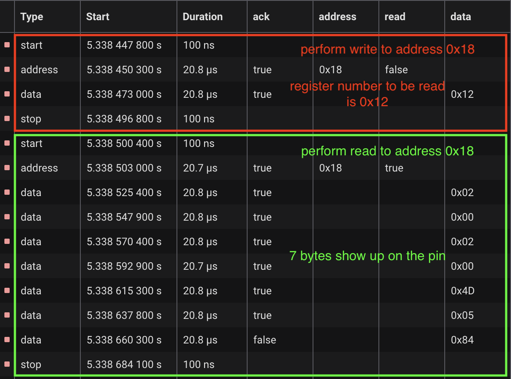
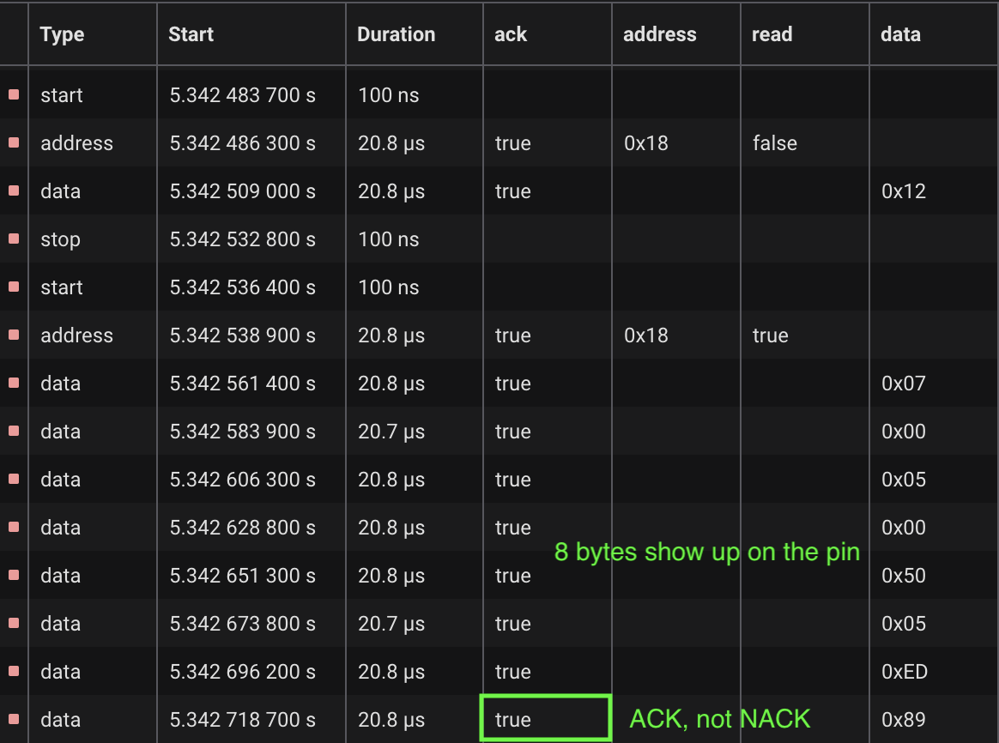
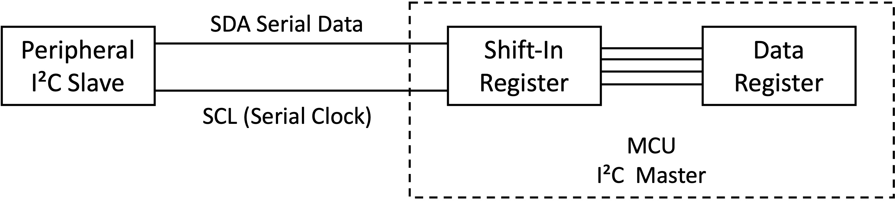

I am using the Rust programming language to program my STM32F405 MCU to perform a DMA read operation from an I²C peripheral. I am using the hardware abstraction layer (HAL) library called [`stm32f4xx-hal`](https://crates.io/crates/stm32f4xx-hal/0.15.0). However, I encountered a problem that the DMA read operation from the I²C peripheral became stuck after a short duration. Specifically, even after handling the DMA transfer completion interrupt, the I²C bus remained busy.

To gather more information, I examined the I²C pins using a logic analyzer. Interestingly, althrough I was reading 6 bytes from the peripheral using DMA, I could always see 7 bytes per read transaction on the wire, as shown below. To recap, when performing a master mode read from a I²C peripheral, one has to first write to it to indicate the register number to read, and the read is terminated by the master sending a NACK after receiving the last byte followed by a stop condition.

After the I²C was stuck, the last read transaction on the bus was even more confusing: there were 8 bytes althrough I was still performing a 6-byte read, and the last byte was not NACK-ed, as shown below.

It turned out that the culprit was the `stm32f4xx-hal` library [forgetting to set the `LAST` bit in the I²C `CR2` register](https://github.com/stm32-rs/stm32f4xx-hal/blob/ee4c13360efca47cbf2fc29272a230e703bfe258/src/i2c/dma.rs#L562-L588). Specifically, during the DMA transfer of the second to last byte from the I²C DR into memory, the DMA will signal the I²C master. However, after receiving the signal, the I²C will only respond to the final byte with a NACK if the `LAST` bit was set.

If the `LAST` bit is not set, the 6th byte will receive an ACK response, causing the peripheral to assume that it should continue to transmit an additional byte. In my particular situation, the peripheral always transmitted zeroes whenever the master attempted to read more bytes than it should. If the DMA transmission complete interrupt was handled timely, the `ACK` bit within the I²C `CR1` would be cleared [within the interrupt handler](https://github.com/stm32-rs/stm32f4xx-hal/blob/ee4c13360efca47cbf2fc29272a230e703bfe258/src/i2c/dma.rs#L450) while the 7th byte was being transmitted on the pin, fotunately causing the master to respond with a NACK.

On the other hand, if the DMA transmission complete interrupt was not promtly handled, perhaps because of handling other interrupts, the I²C master would continue to receive the 7th and 8th byte and respond with ACK. However, at this stage, the DMA had finished reading 6 bytes as we programmed it, the 7th and 8th byte would have no one to move them out from the I²C master.

Based on the block diagram of the I²C master specified in the reference manual, a shift-in register accepts one bit at a time from the SDA line, as illustrated below. Once a complete byte is obtained, it will be transferred into the `DR` register, but only if the previous byte stored within the DR register has already been read out. At the point in time being discussed, the 7th byte was retained in the DR register, whereas the 8th byte resided in the shift-in register.

Since the master still responded the 8th byte with an ACK, so the peripheral would continue to hold the SDA line and proceed to send one more byte. However, the I²C master's registers were already full and unable to receive more data. Consequently, the master forced the SCL line to remain low to prevent the peripheral from transmitting additional data. Even when now the DMA interrupt is handled, the I²C master could not generate a stop condition because the peripheral is holding the SDA line low and the SCL line must also be kept low. This explains why we were not able to see a stop condition before the I²C got stuck.

In the end, the solution was surprisingly straightforward: set the `LAST` bit in the I²C `CR2` register before initiating the read. Nevertheless, locating the source of the issue proved to be exceptionally challenging. As we attempted to simplify our codebase in order to narrow down the problem, the DMA interrupt was more likely to be promptly handled, thereby masking the underlying issue. Thus, it was quite fortunate for us to be able to diagnose the problem and fix it.
