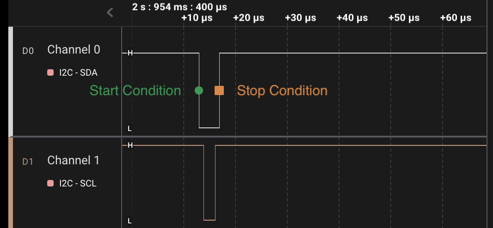

As I was trying to operate a [drone](https://www.bitcraze.io/products/crazyflie-2-1/) using my own RTOS, I encountered an issue where the code became stuck while attempting to interact with a sensor via I²C. Despite one successful read of the sensor, the subsequent one became stuck.

More specifically, the drone is equipped with an STM32F405 MCU, and the process for reading sensor data involves a sequence of two operations using I²C:

1. A I²C write to the peripheral chip to specify the register number to be read.
2. A subsequent I²C read from the peripheral chip to retrieve the data.

Each I²C transaction in master mode can be broken down into the following steps:

1. Generating the start condition by writing to the start bit in `CR1`.
2. Waiting for the start condition to be successfully generated by checking the start bit in `SR1`.
3. Sending the slave peripheral's I²C address by writing to `DR`.
4. Waiting for the address to be sent by checking the address bit in `SR1`.
5. For a write, continuing to write to `DR` and waiting for byte transfer completion after each write by examining the `SR1` register. For a read, waiting until the receive buffer is not empty by checking the `RXNE` bit in `SR1`, and then reading from `DR`.
6. Upon completing all operations, generating the stop condition by writing to the stop bit in `CR1`.
7. Waiting for the stop condition to be generated by checking the busy flag in `SR2`.

In my case, the code became stuck at step 4 during the read process. This was perplexing, given that the I²C address of the peripheral remained constant, and I had already successfully read from it once. In theory, the subsequent read operation should also have been successful.

Adding more to the confusion, upon inspecting the I²C bus with a logic analyzer, I discovered that a stop condition was being automatically generated immediately after the start condition, which prevented the address from being sent out, thus my program was stuck at step 4. The diagram from the logic analyzer is shown below.



According to posts on the STM32 forum, other developers have encountered [similar issues](https://community.st.com/s/question/0D50X00009XkhfnSAB/stm32f2xx-i2c-not-sending-address-after-start) with STM32F207ZG and STM32F446ZE.

This issue was, in some sense, anticipated: the stop bit in `CR1` was found to be set to 1 for an unknown reason and not cleared prior to generating the start condition. As a result, a stop condition is generated immediately after the start condition is initiated.

The workaround suggested on the forum is fairly simple: check the stop bit before generating the start condition, and if it is set, clear it.

```c
if (I2Cx->CR1 & I2C_CR1_STOP)
    I2Cx->CR1 &= ~I2C_CR1_STOP;

// Also wait until the hardware says it's cleared.
while (I2Cx->CR1 & I2C_CR1_STOP);
```

Although the workaround prevented my code from being stuck, in theory, the hardware should clear the stop bit automatically once the stop condition is generated on the wire, and the stop bit should have a value of 0 after completing step 7. I was curious if any specific code pattern caused the I²C to have a stuck stop bit.

Fortunately, I found it. During my debugging of another I²C issue, I inadvertently introduced extra code to step 7:

```c
I2C1->CR1 |= I2C_CR1_STOP;
while(!(I2C1->SR2 & I2C_SR2_BUSY))
    I2C1->CR1 |= I2C_CR1_STOP; // Culprit!
```

Specifically, I had been repeatedly setting the stop bit, which caused it to become stuck at 1 even after the stop condition had been successfully generated. I resolved the issue by removing this line of code, without the need for the previously implemented workaround.

To verify my findings, I replicated the issue on an STM32F407G-DISC board by reading data from the onboard CS43L22 chip via I²C. Interestingly, to cause the code to become stuck on the board, it was necessary to wait for some time after the bus was no longer busy, as illustrated below.

```c
// Generate stop condition.
I2C1->CR1 |= I2C_CR1_STOP;

// Wait until the bus is not busy.
while(!(I2C1->SR2 & I2C_SR2_BUSY));

// Wait for while. Necessary.
for (volatile i = 0; i < 100; ++i);

// Put the stop bit in.
I2C1->CR1 |= I2C_CR1_STOP;
```

The hardware in my case is faithfully doing what is documented in the [reference manual](https://www.st.com/resource/en/reference_manual/dm00031020-stm32f405-415-stm32f407-417-stm32f427-437-and-stm32f429-439-advanced-arm-based-32-bit-mcus-stmicroelectronics.pdf):

> #### I²C CR1
>
> ##### Bit 9 **STOP**: Stop generation
> 
> [...], cleared by hardware when a Stop condition is detected, [...].

So when the I²C bus is already idle, i.e., SCL and SDA line being pulled high, the stop bit will not be cleared by the hardware.
